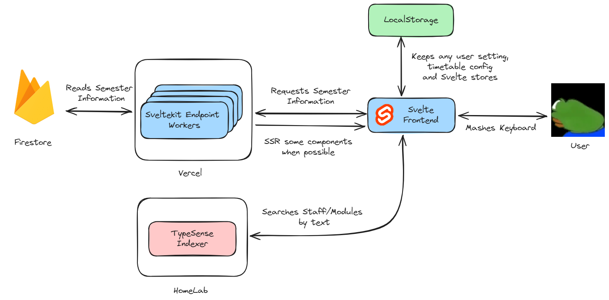

# NTUMoons

NTUMoons is an evolution of this [piece of shit](https://devpost.com/software/ntumods) made almost a while ago. Decided to recreate it in [Sveltekit](https://kit.svelte.dev/), add proper features and have a more polished UI this time. Try it out [here](https://ntumoons.vercel.app)!

## Layout

To break it down:

#### User

A very cute little green dude

#### Svelte Frontend

Component renderer and what our cute user will be interfacing with. Pick up [Svelte](https://learn.svelte.dev/tutorial/welcome-to-svelte) if you wish to contribute, it's like most other frontend frameworks (React, Angular, Vue).

#### LocalStorage

I am not planning to store my users' data anywhere as I would have to handle user management, bot handling and security which are not required for the site's purpose. Storing everyting locally instead with an option for the user to delete everything.

#### Typesense Indexer

[Typesense](https://typesense.org/) is a text based search engine incredibly similar to [Algolia](https://www.algolia.com/) and [ElasticSearch](https://www.elastic.co/elasticsearch). It is used for modules and staff where there are hundreds if not thousands of documents to be gone through. For deployment, it is currently hosted on my homelab so hopefully it is not abused.

All data is inserted through the several web [scrapers](https://github.com/Benjababe/ntumoons/tree/development/scrapers) written.

#### Sveltekit Endpoints

This is the "backend" of the project, having the endpoints defined in `+server.ts` files under the `api` directory. Vercel should spawn serverless workers to handle backend requests on the fly.

#### Firestore

Firebase is the database of choice, free and easy to integrate. It is so far read-only, no writes are expected in the near future. All data is inserted through the several web [scrapers](https://github.com/Benjababe/ntumoons/tree/development/scrapers) written.

## Todos

Refer to the [issues](https://github.com/Benjababe/ntumoons/issues) page for any outstanding tasks. Feel free to add any if there is anything the site lacks.

## Contributing

Make sure to use `feet:` instead of `feat:` for features. Heck, use `feet:` for any changes made in commits, who's checking.
